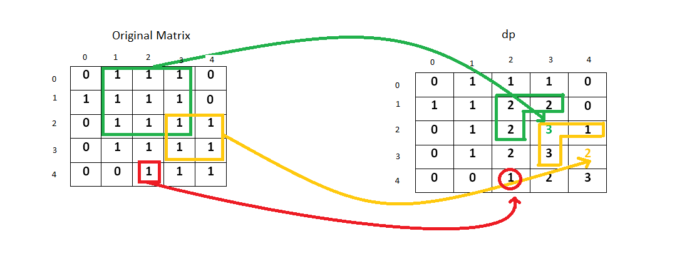

# 221. 最大正方形

### 题目介绍

**难度：中等**

在一个由 0 和 1 组成的二维矩阵内，找到只包含 1 的最大正方形，并返回其面积。

示例:

输入: 

1 0 1 0 0
1 0 1 1 1
1 1 1 1 1
1 0 0 1 0

输出: 4

来源：力扣（LeetCode）
链接：https://leetcode-cn.com/problems/maximal-square
著作权归领扣网络所有。商业转载请联系官方授权，非商业转载请注明出处。

### 解题思路

