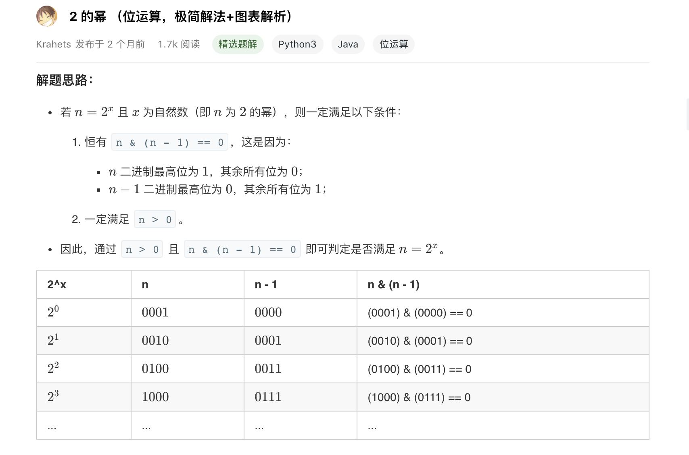

# 231. 2的幂

难度：简单

给定一个整数，编写一个函数来判断它是否是 2 的幂次方。

示例 1:

输入: 1
输出: true
解释: 2^0 = 1

示例 2:

输入: 16
输出: true
解释: 2^4 = 16

示例 3:

输入: 218
输出: false

来源：力扣（LeetCode）
链接：https://leetcode-cn.com/problems/power-of-two
著作权归领扣网络所有。商业转载请联系官方授权，非商业转载请注明出处。

### 解题思路

参考来源：

作者：jyd
链接：https://leetcode-cn.com/problems/power-of-two/solution/power-of-two-er-jin-zhi-ji-jian-by-jyd/
来源：力扣（LeetCode）
著作权归作者所有。商业转载请联系作者获得授权，非商业转载请注明出处。

