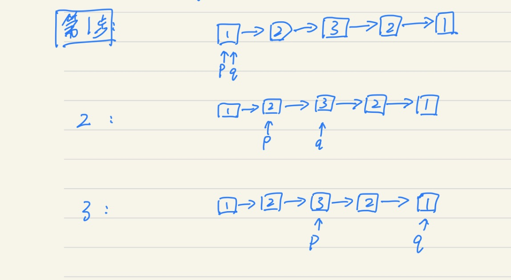
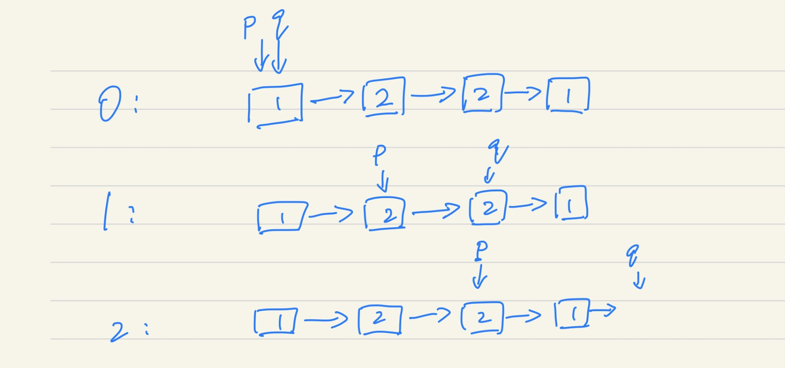

# 234. 回文链表

**难度：简单**

请判断一个链表是否为回文链表。

示例 1:

输入: 1->2
输出: false
示例 2:

输入: 1->2->2->1
输出: true
进阶：
你能否用 O(n) 时间复杂度和 O(1) 空间复杂度解决此题？

来源：力扣（LeetCode）
链接：https://leetcode-cn.com/problems/palindrome-linked-list
著作权归领扣网络所有。商业转载请联系官方授权，非商业转载请注明出处。

### 解题思路

解题思路1：

空间复杂度：O(1)

1. 使用快慢指针将链表从中间拆开，慢指针会指向中间节点

2. 将前半段或者后半段，进行翻转

3. 比较两段链表是否一致

**链表结点的数量为奇数**

如果是奇数节点的话，那么快慢指针停止时，

q != nil && q.Next == nil

忽略p，后半段链表从p的下一个节点开始。

**链表结点的数量为偶数**

如果是偶数节点的话，那么快慢指针停止时，

q == nil

后半段链表从p自身的节点开始。

### 执行结果

执行用时 : 16 ms , 在所有 golang 提交中击败了 95.74% 的用户

内存消耗 : 6 MB , 在所有 golang 提交中击败了 76.23% 的用户