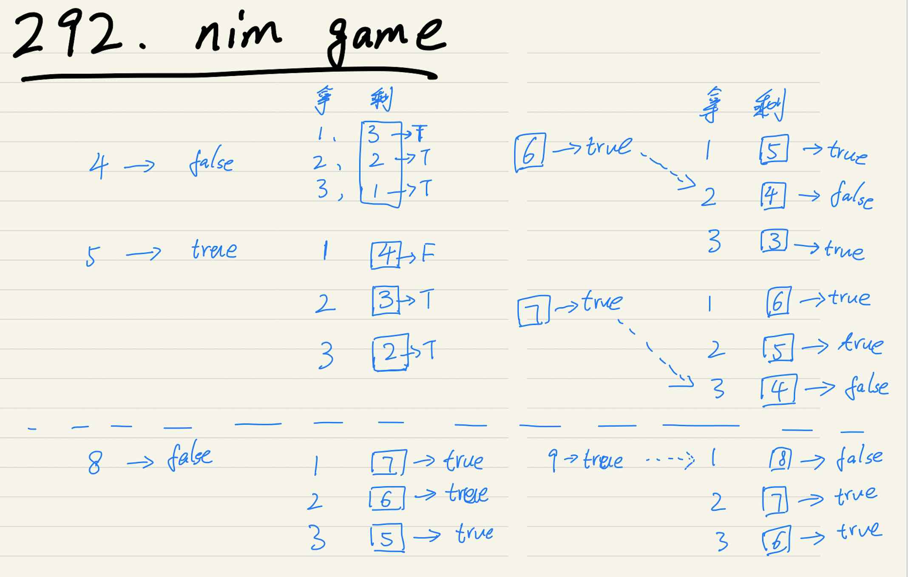

# 292. Nim游戏

难度：简单

你和你的朋友，两个人一起玩 Nim 游戏：桌子上有一堆石头，每次你们轮流拿掉 1 - 3 块石头。 拿掉最后一块石头的人就是获胜者。你作为先手。

你们是聪明人，每一步都是最优解。 编写一个函数，来判断你是否可以在给定石头数量的情况下赢得游戏。

示例:

输入: 4
输出: false 
解释: 如果堆中有 4 块石头，那么你永远不会赢得比赛；
     因为无论你拿走 1 块、2 块 还是 3 块石头，最后一块石头总是会被你的朋友拿走。

来源：力扣（LeetCode）
链接：https://leetcode-cn.com/problems/nim-game
著作权归领扣网络所有。商业转载请联系官方授权，非商业转载请注明出处。

### 解题思路

使用动态规划推导

初始条件：

dp[1] = dp[2] = dp[3] = true

状态转移方程：

可以拿1-3个，

所以依次还会剩下：n-1、n-2、n3，对于这3个数量的石子，

对方是否会获胜为dp[n-1]、dp[n-2]、dp[n-3]。

只要对方不是必胜，也即上述只要出现false，那么对于我们来说就是胜利。

比如：

石子为4时，即dp[4]：

- 拿1个石子，剩下3个，对方的结果为：dp[3]：true，胜利
- 拿2个石子，剩下2个，对方的结果为：dp[3]：true，胜利
- 拿3个石子，剩下1个，对方的结果为：dp[3]：true，胜利

当石子还剩下4个时，对方必胜，我方必输，即`dp[4]=false`

石子为5时，即dp[5]：

- 拿1个石子，剩下4个，对方的结果为：dp[4]：false，失败
- 拿2个石子，剩下3个，对方的结果为：dp[3]：true，胜利
- 拿3个石子，剩下2个，对方的结果为：dp[2]：true，胜利

由上述我们可以选择拿1个石子，这样对方即会失败，我方胜利，所以`dp[5]=true`

**优化**

通过动态规划的推导，发现每4个石子为关键点。如果是4的倍数，那么必输，其他的情况是必胜。

